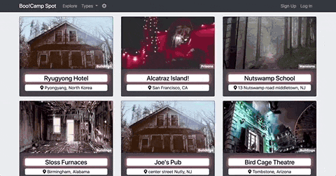
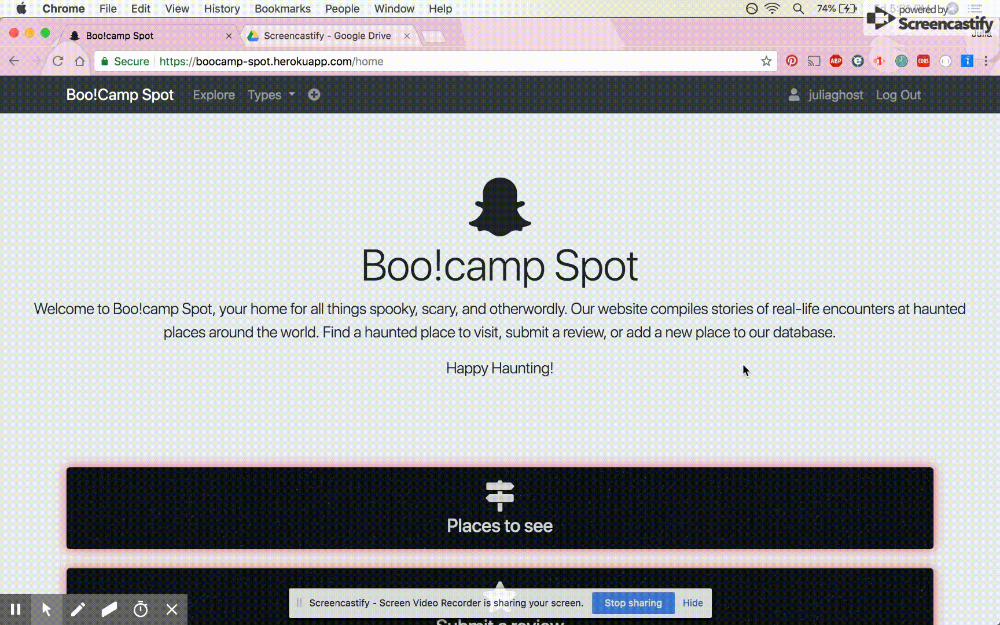

# Boo!camp Spot
Visit it <a href="https://boocamp-spot.herokuapp.com/" target="_blank">here!</a>

# Concept & Utilization
This app allows users to view haunted places from around the world. Each place has a card with its title, a short description, and an image. Places can be filtered by type (Building, Forests, Prisons, etc.). After clicking the card the user is directed to the place's page, which shows reviews and accounts from other users who have visited. Users can submit their own review, and edit or delete it after submission. They can also submit new places and add to our database. Each user's profile shows the date their profile was created (called their "Boo day") and their reviews and submissions.

# Technologies Used (Dependencies)
* bcryptjs
* body-parser
* express
* express-handlebars
* gravatar
* jsonwebtoken
* mysql2
* passport
* passport-jwt
* request
* sequelize

# Demo videos

# Future Functionality
* Interactive map displaying haunted places
* Collect user photos from places
* Chat feature to allow visitors to chat with one another
* Autosuggested places for users based on location and past reviews
* Profile badges for users based on their activity - reviews, places submitted, and amount of time they've been signed up
